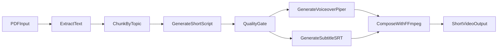

# PDF -> Gen Z Shorts (Free, Local-First)

Pipeline Python de chuyen PDF thanh short video hoc tap (30-90s), uu tien mien phi va han che quota API.

## Features

- Local-first: parse PDF, chunk noi dung, tao script qua Ollama.
- Fallback provider: OpenRouter free model neu local gap loi.
- Cache theo hash chunk de tranh goi model lap lai.
- Voiceover tu Piper TTS (offline).
- Burn subtitle va render mp4 bang FFmpeg.
- Co quality gate: do dai script, hook, CTA, so y chinh.

## Setup

1. Cai Python 3.11+.
2. Cai dependencies:
   - `pip install -r requirements.txt`
3. Cai binary can thiet:
   - `ffmpeg`
   - `piper`
   - `ollama` + model (`ollama pull qwen2.5:7b-instruct`)
4. Chuan bi file:
   - PDF input (vi du `input.pdf`)
   - video nen (`assets/background.mp4`)
   - model voice piper (`vi_VN-vais1000-medium.onnx`)

Neu muon fallback OpenRouter, tao file `.env`:

```bash
OPENROUTER_API_KEY=your_key_here
```

## Run

```bash
python -m pdf2genz.cli --pdf input.pdf --bg-video assets/background.mp4 --videos 10
```

Dry run (test parse/chunk/script, bo qua TTS va render):

```bash
python -m pdf2genz.cli --pdf input.pdf --dry-run
```

## Output

- `outputs/01.wav`, `outputs/01.srt`, `outputs/01.mp4`, ...
- Cache script: `.work/cache/*.json`

## Architecture



# VibeSeek

VibeSeek is a cinematic AI-learning web app built with Next.js + React Three Fiber.
The landing experience is now a 3-state login intro:

1. **Landing/Login**: AI Prism in focus, crystals pushed into deep background Z-space.
2. **Auth Transition**: camera flies through the prism using GSAP.
3. **Upload Dashboard**: route to `/dashboard` for PDF upload and AI card generation.

## Quick Start

From the `vibeseek` directory:

```bash
npm install
copy .env.local.example .env.local
npm run dev
```

Fill these variables in `.env.local`:

- `NEXT_PUBLIC_SUPABASE_URL`
- `NEXT_PUBLIC_SUPABASE_ANON_KEY`
- `SUPABASE_SERVICE_ROLE_KEY`
- `GEMINI_API_KEY`

## Project Folder Structure

```text
vibeseek/
├─ app/
│  ├─ page.tsx                  # Landing/Login entry point
│  ├─ dashboard/
│  │  └─ page.tsx               # PDF upload dashboard
│  └─ api/vibefy/route.ts       # PDF -> AI cards endpoint
├─ components/
│  └─ 3d/
│     ├─ LoginSceneCanvas.tsx   # Main R3F scene + GSAP camera transition
│     ├─ LoginOverlay.tsx       # Login UI overlay
│     ├─ SceneLoader.tsx        # Suspense loading UI
│     ├─ PrismModel.tsx         # AI Prism GLB + MeshTransmissionMaterial
│     └─ CrystalCluster.tsx     # Background crystal model group
├─ public/
│  └─ models/
│     ├─ a_circled_dodecahedron.glb
│     └─ magic_crystals.glb
└─ README.md
```

## 3D Scene Orchestration

### Camera

- `PerspectiveCamera` starts at `z=8` to frame the prism.
- Login action triggers a GSAP timeline:
  - pushes crystals deeper on Z (`-14` -> `-22`),
  - scales prism for impact,
  - flies camera through prism (`z=8` -> `z=-7.8`),
  - then completes with route redirect.

### Lighting and Depth

- `ambientLight` + `directionalLight` establish base readability.
- Purple and cyan `pointLight`s create brand tones and depth separation.
- `fog` supports distance fade for background crystals.

### Post-processing

- `EffectComposer` with:
  - `DepthOfField` to keep prism sharp and blur deep crystals.
  - `Bloom` for emissive glow.

### Motion Layer

- `Float` from `@react-three/drei` adds ambient motion.
- `gsap` handles cinematic camera choreography and state transition.
- `Suspense` + custom `SceneLoader` provides graceful model-loading UX.

## Routing Logic: Landing -> Dashboard

- `app/page.tsx` owns scene state:
  - `landing` (default)
  - `transition` (after login click)
- `LoginOverlay` triggers `handleLogin()`.
- `LoginSceneCanvas` executes GSAP fly-through and calls `onTransitionComplete`.
- Completion callback performs `router.push('/dashboard')`.

## Dashboard Upload Flow

- `/dashboard` contains a production-ready upload form.
- On submit:
  - sends multipart data (`pdf`, `title`, `maxCards`) to `/api/vibefy`.
  - shows error feedback if request fails.
  - previews first generated cards when successful.

## Commands

```bash
npm run dev
npm run build
npm run start
npm run lint
```

## Agent Guidelines: Future "AI Video Generation"

When extending VibeSeek with AI video generation, follow these constraints:

1. **Do not break the 3-state intro contract**  
   Keep Landing -> Transition -> Dashboard deterministic and fast.

2. **Add video generation as a dashboard module**  
   Create a separate section (or route group) under `/dashboard` for async jobs and progress tracking.

3. **Use queue-based architecture for heavy tasks**  
   For long-running renders, persist job states in DB and poll from UI instead of blocking API responses.

4. **Keep 3D scene lightweight**  
   Landing scene should stay GPU-cheap; avoid introducing video decode/render work there.

5. **Version API payloads**  
   Add typed request/response contracts before integrating model providers to keep agent changes safe.
